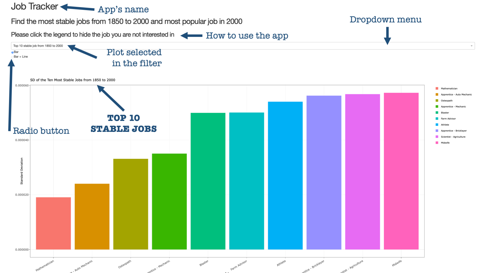
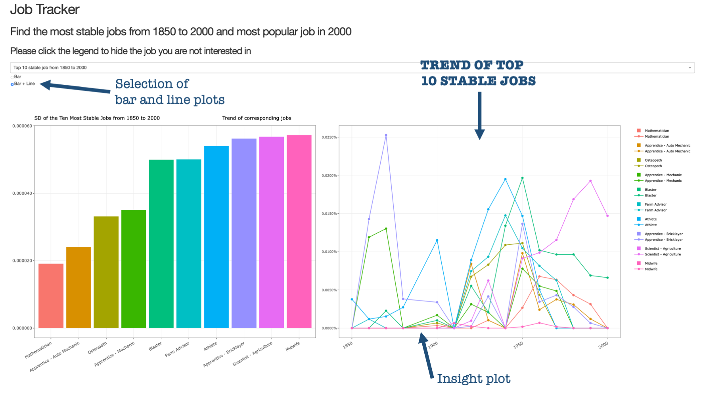
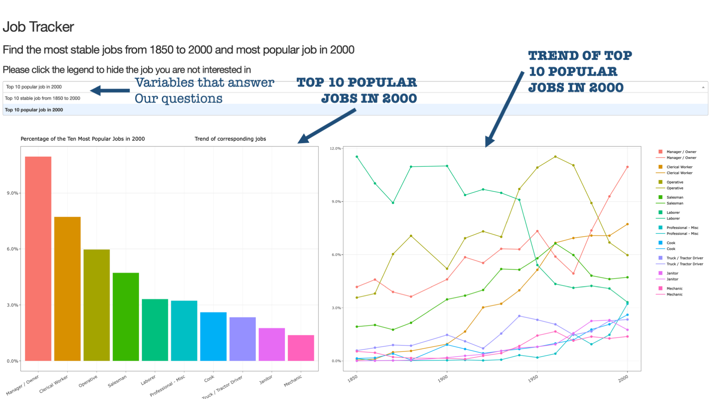
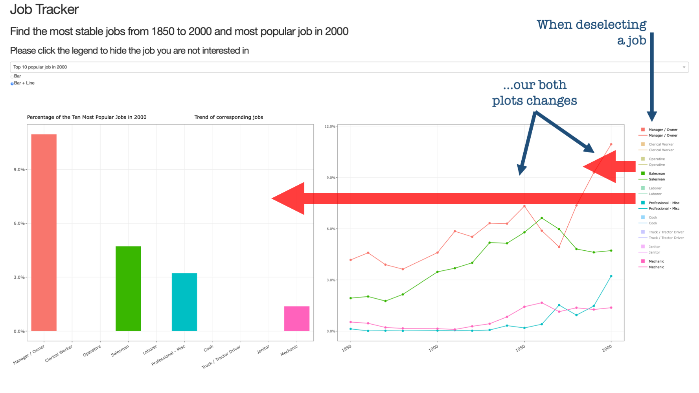

# Job Data Analysis

### Team members
Huayue -Luke- Lu: [mglu123](https://github.com/mglu123)  
Manish Joshi: [ManishPJoshi](https://github.com/ManishPJoshi)  
Victor Cuspinera: [vcuspinera](https://github.com/vcuspinera)  

## DESCRIPTION OF THE APP & SKETCH

The central purpose of this app is to be a quick guiding tool to any person who wants to know which are the professions that are still standing relevant, which are the ones that have gained in popularity and, which are the ones that have fallen by the wayside.  
This app can be used by sociologists for their research, by government planners and educationists to make decisions about the society’s education. It can also be used by the high school or college graduate to acquire an insight into what skills he or she needs to acquire to be gainfully employed in a stable occupation. The data set allows us to go back in time for more than 150 years. It would be very interesting to see which of these jobs have maintained a sustained requirement for such a long period, and which are the most popular jobs lately.
  
  
### Our App

**[Access to our app on Heroku here.](https://dsci532-g208-milestone4-r.herokuapp.com)**

- The app consists of 2 sections. The menu section at the top allows the user to choose the data he or she would like to visualize. The section below is the plot section and this is where the data is visualized.

- The menu section comprises of one dropdown menu that allows the user to choose between the "top 10 most stable jobs over time" and "the most popular jobs in the year 2000". Besides the dropdown menu, there is a radio button that allows the user to choose between view the Bar plots that answer our question, and view both the bar and line graphs (this second one is an insight plot gives context to the research question).

- The plots section primarily consists of 2 plots faceted side by side. The plot on the left is a Vertical bar plot that answers the research questions and the plot on the right is a line graph which is an insight plot that add context to the answer of the research questions.

- The user can click the legend to hide the job he/she is not interested in.

- It is programmed in R with *ggplot2* and *ggplotly*.
  
  
### The plots

This is the first impression when the user gets into this app:

  
View of the app when the user select to see the bar and line plot:

  
The users can look for the answer of our questions of interest:

  
Selection jobs from top 10:

  
    
Here you would find the [Code of the R plots](https://github.com/UBC-MDS/DSCI_532_group_208_DashR_Job/blob/master/Code/job_plots.ipynb) and the [folder with the images of the plots](https://github.com/UBC-MDS/DSCI_532_group_208_DashR_Job/tree/master/Img).
